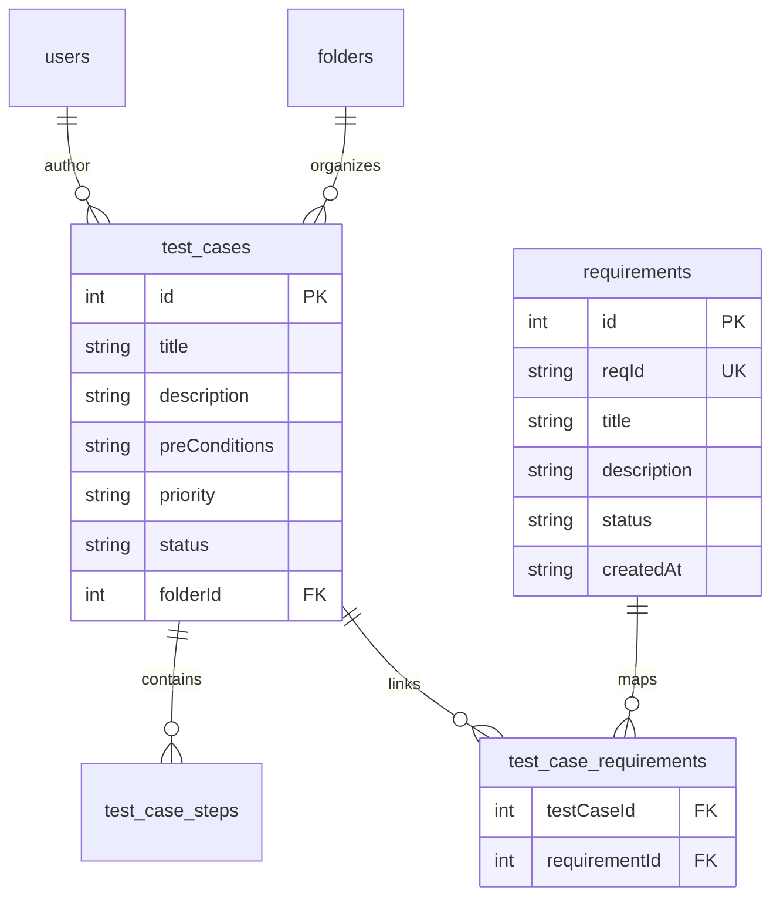
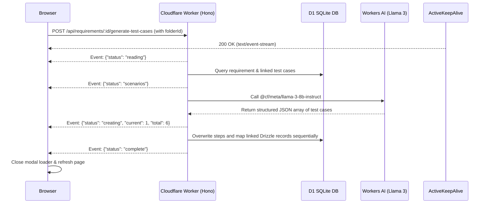

# TestCase Pro - Edge Edition

A production-ready Test Case Management System built with Hono, Cloudflare Workers, and D1.

## Functional Features

TestCase Pro provides a robust, high-performance edge ecosystem for full QA lifecycles:

*   **Requirements Tracking**: Comprehensive user story management module where QA teams can track features, organize them by status (`Open`, `In Progress`, `Implemented`, `Closed`), and map them to their corresponding verification test cases.
*   **AI-Powered Test Case Generation**: Harnesses Cloudflare Workers AI with `@cf/meta/llama-3-8b-instruct` to automatically generate deep QA test suites (complete with titles, intent description, preconditions, priority, and step-by-step actions/expected outcomes) directly from a user story.
*   **Deduplication & Regeneration Algorithm**: Sophisticated database synchronizer that maps newly regenerated AI test cases against existing entries. It updates matches, inserts fresh validations, and safely prunes obsolete records sequentially.
*   **Real-time SSE Progress Tracker**: Highly interactive glassy progress modal overlay that streams progress milestones via fetch streaming and Server-Sent Events (SSE) (Reading User Stories -> Figuring out scenarios -> Creating/Writing Test Cases).
*   **Dashboard Telemetry**: High-level overview displaying Total Test Cases, Total Requirements, Test Suites, and Test Runs. Renders beautiful interactive Doughnut and Line charts displaying test outcomes and execution trends over 30 days.
*   **Test Plan Repository**: Organize test cases into tree folder directories, supporting manual case drafting, tag assignments, inline CSV exports, and CSV imports in bulk.
*   **Test Execution & Audits**: Create suites, assign execution tasks to QA team members, perform step-by-step test runs, and record results (`Passed`, `Failed`, `Blocked`, `Hold`).
*   **Guest Mode Access**: Secure JWT cookies handling session roles, protecting CRUD mutations while enabling view-only permissions for guest stakeholders.

---

## User Guide

Follow these steps to track requirements and generate test cases with AI:

### 1. Creating a Requirement
1.  Navigate to the live site and log in with your QA credentials (e.g. `admin@testcasepro.com` / `admin123`).
2.  Click the **Requirements** tab in the sidebar navigation.
3.  Click **New Story** to open the creation modal.
4.  Enter the **Title** (e.g. `As a customer, I can reset my password securely`) and the **Acceptance Criteria** in the description.
5.  Select the initial status as `Open` and click **Create**. The requirement will be saved and formatted sequentially as `REQ-001`.

### 2. Generating Test Cases with Workers AI
1.  On the newly created requirement row, click the blue **Generate** button.
2.  In the AI configuration dialog, optionally select a target **Test Suite/Folder** from your project tree.
3.  Click **Generate Scenarios** to start the Workers AI pipeline.
4.  A glassy modal loader overlay will appear showing the real-time progress stream:
    *   `[x] Reading User Stories`
    *   `[x] Figuring out test scenarios`
    *   `[/] Creating Test Cases (4/6)`
5.  Once the stream signals completion, the loader will automatically close and refresh the view, instantly showing the 6 linked test cases in your repository!

### 3. Reviewing and Running Test Cases
1.  Navigate to **Test Plan** to view the full descriptions, preconditions, and step-by-step actions/expected results created by the AI.
2.  Create a **Test Run**, execute each step, mark them `Passed` or `Failed`, and view the outcomes update dynamically on your **Dashboard**!

---

## Tech Stack

### Runtime: Cloudflare Workers (Edge)
**Why we chose it:**
- **Global Edge Deployment**: Code runs in 300+ data centers worldwide, ensuring ultra-low latency (<50ms) for users regardless of location
- **Zero Cold Starts**: Unlike traditional serverless (AWS Lambda), Workers have near-instant startup times (~0ms cold start)
- **Cost Effective**: Pay only for compute time with generous free tier (100,000 requests/day free)
- **Built-in Security**: Automatic DDoS protection, SSL/TLS, and isolated V8 execution environment
- **Simplified DevOps**: No server management, auto-scaling, or infrastructure maintenance required
- **Edge Caching**: Built-in Cache API for caching responses at the edge, reducing Worker invocations

### Framework: Hono
**Why we chose it:**
- **Ultralight & Fast**: Only 14KB in size, designed specifically for edge runtimes with exceptional performance
- **Edge-First Design**: Built from the ground up for Cloudflare Workers, Deno, and Bun
- **Familiar API**: Express-like routing syntax makes migration and onboarding seamless
- **Built-in JSX Support**: Server-side rendering with JSX without needing React, reducing bundle size
- **TypeScript Native**: First-class TypeScript support with excellent type inference
- **Middleware Ecosystem**: Rich set of built-in middleware for auth, CORS, compression, and more

### Database: Cloudflare D1 (SQLite)
**Why we chose it:**
- **Edge-Native SQL**: SQLite database that runs at the edge, co-located with Workers for minimal latency
- **Zero Configuration**: No connection strings, connection pooling, or database server management
- **Familiar SQL**: Full SQLite compatibility means standard SQL queries and easy migration
- **Cost Efficient**: Generous free tier with pay-as-you-go pricing for production workloads
- **Automatic Backups**: Built-in point-in-time recovery and disaster protection
- **Global Replication**: Data automatically replicated for high availability

### ORM: Drizzle ORM
**Why we chose it:**
- **Type-Safe Queries**: Full TypeScript inference from schema to query results prevents runtime errors
- **SQL-Like Syntax**: Queries read like SQL, making debugging and optimization intuitive
- **Lightweight**: No heavy runtime dependencies, perfect for edge environments with size constraints
- **D1 Integration**: First-class Cloudflare D1 support with optimized drivers
- **Schema Migrations**: Built-in migration system with SQL file generation for version control
- **Zero Overhead**: Generates optimal SQL without N+1 query problems

### Styling: Tailwind CSS
**Why we chose it:**
- **Utility-First**: Rapid UI development without context-switching to separate CSS files
- **Production Optimized**: PurgeCSS removes unused styles, resulting in tiny CSS bundles (~10KB)
- **Consistent Design System**: Built-in spacing, color, and typography scales ensure visual consistency
- **Responsive by Default**: Mobile-first breakpoints (`sm:`, `md:`, `lg:`) built into every utility
- **No CSS Conflicts**: Scoped utilities eliminate specificity wars and cascade issues
- **IDE Support**: Excellent IntelliSense with autocomplete for all utilities

### Interactivity: HTMX + Alpine.js
**Why we chose it:**
- **No Build Step Required**: Both libraries work via CDN with zero compilation needed
- **HTML-Centric**: Enhances HTML with attributes rather than replacing it with JavaScript frameworks
- **Minimal JavaScript**: Achieve SPA-like experiences with 90% less client-side JavaScript
- **HTMX for AJAX**: Declarative HTTP requests (`hx-get`, `hx-post`) for dynamic content loading
- **Alpine.js for State**: Lightweight reactivity (`x-data`, `x-show`, `x-on`) for UI interactions
- **Progressive Enhancement**: Works without JavaScript, enhanced experience when available
- **Tiny Footprint**: Combined ~25KB vs React (~45KB) + React-DOM (~120KB)

### Charts: Chart.js
**Why we chose it:**
- **Canvas-Based Rendering**: Smooth animations and high performance with HTML5 Canvas
- **Responsive by Default**: Charts automatically resize to container dimensions
- **8 Chart Types**: Bar, line, pie, doughnut, radar, polar, bubble, and scatter charts included
- **Highly Customizable**: Extensive configuration options for colors, fonts, tooltips, and legends
- **Active Community**: Well-maintained with extensive documentation and plugins ecosystem
- **Accessibility**: Built-in ARIA support for screen readers and keyboard navigation

## Prerequisites

- Node.js 18+
- Wrangler CLI (`npm install -g wrangler`)
- Cloudflare account

## Setup

### 1. Install dependencies

```bash
npm install
```

### 2. Create D1 Database

```bash
# Create the database
wrangler d1 create testcase-pro-db

# Update wrangler.toml with the database_id from the output
```

### 3. Run migrations

```bash
# Local development
wrangler d1 execute testcase-pro-db --local --file=./drizzle/0000_init.sql

# Production
wrangler d1 execute testcase-pro-db --file=./drizzle/0000_init.sql
```

### 4. Build CSS

```bash
npm run css:build
```

### 5. Run development server

```bash
npm run dev
```

The app will be available at `http://localhost:8787`

## Deployment

### Deploy to Cloudflare Workers

```bash
# Build CSS first
npm run css:build

# Deploy
npm run deploy
```

## Environment Variables

Set these in your Cloudflare dashboard or wrangler.toml:

- `JWT_SECRET`: Secret key for JWT tokens (change in production!)

## Project Structure

```
edge/
├── src/
│   ├── index.ts              # Main Hono app
│   ├── types.ts              # TypeScript types
│   ├── db/
│   │   ├── schema.ts         # Drizzle schema
│   │   └── index.ts          # D1 connection
│   ├── lib/
│   │   ├── auth.ts           # JWT & password utilities
│   │   └── utils.ts          # Helper functions
│   ├── middleware/
│   │   └── auth.ts           # Auth middleware
│   ├── routes/
│   │   ├── api/              # API routes
│   │   │   ├── auth.ts
│   │   │   ├── folders.ts
│   │   │   ├── test-cases.ts
│   │   │   ├── tags.ts
│   │   │   ├── test-suites.ts
│   │   │   ├── test-runs.ts
│   │   │   └── dashboard.ts
│   │   └── pages/            # Page routes (SSR)
│   │       ├── index.ts
│   │       ├── dashboard.tsx
│   │       ├── test-plan.tsx
│   │       ├── test-run.tsx
│   │       ├── reports.tsx
│   │       └── auth.tsx
│   ├── components/           # Hono JSX components
│   │   ├── Layout.tsx
│   │   ├── Card.tsx
│   │   ├── Button.tsx
│   │   └── ...
│   ├── styles/
│   │   └── input.css         # Tailwind input
│   └── static/
│       └── styles.css        # Built CSS (generated)
├── drizzle/
│   └── 0000_init.sql         # Database migrations
├── wrangler.toml             # Cloudflare config
├── tailwind.config.ts
├── tsconfig.json
└── package.json
```

## Edge Caching Strategy

This application implements aggressive edge caching to minimize Cloudflare Workers requests and reduce costs.

### Cache Tiers

| Resource Type | TTL | Strategy |
|--------------|-----|----------|
| Static Assets (CSS) | 1 year | Immutable, fingerprinted |
| CDN Libraries (JS) | 1 year | Immutable, versioned |
| Dashboard Stats API | 5 min | Stale-while-revalidate |
| List APIs (folders, test cases) | 2 min | Stale-while-revalidate |
| Individual Item APIs | 1 min | Stale-while-revalidate |

### How It Works

1. **Static Assets**: CSS and other static files are served with `Cache-Control: public, max-age=31536000, immutable` headers. The browser and edge cache them indefinitely.

2. **API Responses**: GET requests to API endpoints include `Cache-Control` headers with appropriate TTLs. The Cloudflare edge caches these responses and serves them without invoking the Worker.

3. **Stale-While-Revalidate**: API responses use `stale-while-revalidate` to serve cached content immediately while refreshing in the background.

4. **ETag Support**: ETags are generated for responses, enabling conditional requests (304 Not Modified) that save bandwidth.

5. **Cache Invalidation**: POST/PUT/DELETE requests bypass the cache, and related cache entries are purged on mutations.

### Expected Benefits

- **70-90% reduction in Worker requests** for typical usage patterns
- **Faster response times** (0ms from edge cache vs 50-200ms from Worker)
- **Lower costs** (fewer Worker invocations = lower billing)
- **Better reliability** (cached responses available even during Worker issues)

### Local Development

Note: The Cloudflare Cache API works differently in local development (wrangler dev). To fully test caching behavior, deploy to Cloudflare Workers staging environment.

## Architecture Information

TestCase Pro leverages a modern, single-worker edge server architecture to achieve near-zero latency and high scalability:

### 1. Single-Worker Pipeline
Both the frontend server-side rendered pages (built with Hono JSX) and the REST JSON APIs are compiled and deployed within a single Cloudflare Worker. This eliminates the need for separate hosting platforms, eliminates CORS complexity, and keeps bundles extremely light.

### 2. Database Schema Relationships
Our SQLite database is powered by Cloudflare D1 and mapped with Drizzle ORM.
*   **Many-to-Many Linking**: A junction table `test_case_requirements` maps test cases to requirements. It sets a composite unique index on `[testCaseId, requirementId]` to prevent duplicates, with `onDelete: 'cascade'` to auto-prune links on deletes.
*   **One-to-Many Steps**: `test_case_steps` maps individual action/outcome steps to a single `testCaseId`.
*   **One-to-Many Folders**: `folders` references a self-referential `parentId` to enable nested directory configurations.



### 3. Real-Time Data Flow (SSE Streaming)
The AI test case generation workflow utilizes HTTP streaming Server-Sent Events (SSE) to update the client in real-time during long-running Worker operations:



---

## API Endpoints

### Authentication
- `POST /api/auth/signup` - Create account
- `POST /api/auth/signin` - Sign in
- `POST /api/auth/signout` - Sign out
- `GET /api/auth/session` - Get current session

### Folders
- `GET /api/folders` - List all folders
- `POST /api/folders` - Create folder
- `PUT /api/folders/:id` - Update folder
- `DELETE /api/folders/:id` - Delete folder

### Test Cases
- `GET /api/test-cases` - List test cases
- `GET /api/test-cases/:id` - Get test case
- `POST /api/test-cases` - Create test case
- `PUT /api/test-cases/:id` - Update test case
- `DELETE /api/test-cases/:id` - Delete test case
- `GET /api/test-cases/export` - Export as CSV
- `POST /api/test-cases/import` - Import from CSV
- `DELETE /api/test-cases/bulk-delete` - Bulk delete

### Test Suites
- `GET /api/test-suites` - List test suites
- `GET /api/test-suites/:id` - Get test suite with entries
- `POST /api/test-suites` - Create test suite
- `DELETE /api/test-suites/:id` - Delete test suite

### Test Runs
- `GET /api/test-runs/:id` - Get test run entry
- `PUT /api/test-runs/:id` - Update test run entry

### Dashboard
- `GET /api/dashboard/stats` - Get dashboard statistics

## Pending Features and Roadmap

The following architectural scaling features are planned for future releases:

1.  **Custom AI Prompt Tuning**: Interface to upload custom prompt templates or compliance files to tailor the generated actions/outcomes.
2.  **External Syncing (Jira / GitHub)**: Webhook support to automatically pull user stories from Jira or GitHub Issues directly into the Requirements database.
3.  **Executable Playwright Exporter**: Export the AI-generated steps directly into executable Puppeteer, Playwright, or Cypress Javascript templates.
4.  **Telemetry Dashboard**: Track Workers AI token expenditures and average generation response times in reports.

---

## License

MIT

